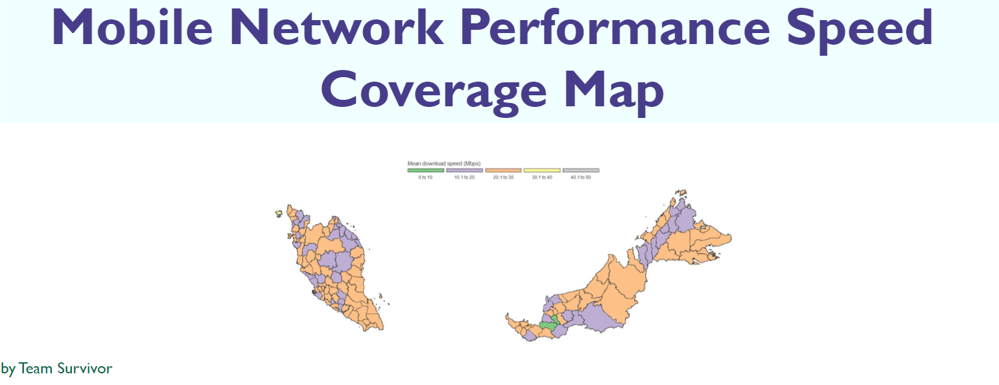
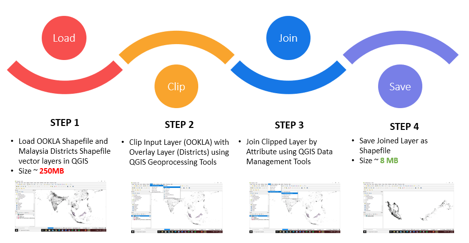

## Introduction

## Data Source

Performance tiles from OOKLA:

<https://ookla-open-data.s3.amazonaws.com/shapefiles/performance/type=mobile/year=2020/quarter=1/2020-01-01_performance_mobile_tiles.zip>

<https://ookla-open-data.s3.amazonaws.com/shapefiles/performance/type=mobile/year=2020/quarter=2/2020-04-01_performance_mobile_tiles.zip>

<https://ookla-open-data.s3.amazonaws.com/shapefiles/performance/type=mobile/year=2020/quarter=3/2020-07-01_performance_mobile_tiles.zip>

<https://ookla-open-data.s3.amazonaws.com/shapefiles/performance/type=mobile/year=2020/quarter=4/2020-10-01_performance_mobile_tiles.zip>

<https://ookla-open-data.s3.amazonaws.com/shapefiles/performance/type=mobile/year=2021/quarter=1/2021-01-01_performance_mobile_tiles.zip>

Malaysia Map from Stanford Libraries:

<https://earthworks.stanford.edu/catalog/stanford-zd362bc5680>

## Data Size Reduction Process

Parse OOKLA shapefile according to Malaysia Districts using QGIS
software:

1.  Load OOKLA shapefile and Malaysia Districts vector layers
2.  Vector-&gt;GeoprocessingTools-&gt;Clip \[InputLayer:OOKLA,
    OverlayLayer:MalaysiaDistricts\]
3.  Vector-&gt;DataManagementTools-&gt;JoinAttributebyLocation
    \[BaseLayer:\#2, JoinLayer:MalaysiaDistricts,
    GeometricPredicate:Overlaps&Within\]
4.  Save the joined layer as shapefile

## Links

ShinyApps <https://s2016903.shinyapps.io/Survivor/>

RPubs Slidify <https://rpubs.com/S2039977/MobileNetworkPerformance>

GitHub <https://github.com/s2016903/WQD7001>

Video Presentation <https://youtu.be/vl1QLQDKYzM>
